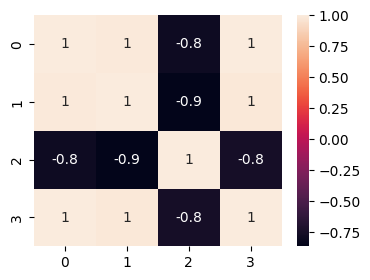
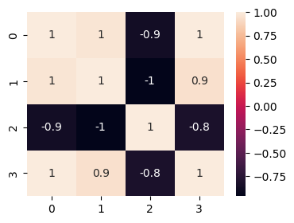
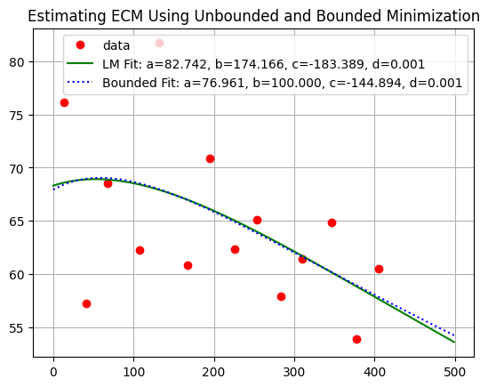

# Explore Minimization Methods for Milkbot Estimation Applied to ECM
## Unconstrained Optimization: Levenberg-Marquardt Algorithm

- Milkbot Parameter Estimates a=82.742, b=174.166, c=-183.389, d=0.001

- Error Correlation Matrix

- Initial Parameters: [ 9.0e+01  1.0e+02 -1.5e+01  2.0e-03]

- Function Evaluations: 56

- Convergence Message Both actual and predicted relative reductions in the sum of squares
  are at most 0.000000

- Return Status 1
## Constrained Optimization: Trust Region Reflective Algorithm

- Milkbot Parameter Estimates a=76.961, b=100.000, c=-144.894, d=0.001

- Error Correlation Matrix

- Initial Parameters:     [ 9.0e+01  1.0e+02 -1.5e+01  2.0e-03]

- Parameter Lower Bounds: [0.0, 0.0, -1000.0, 0.0]

- Parameter Upper Bounds: [200.0, 100.0, 1000.0, 0.01]
## Comparison

